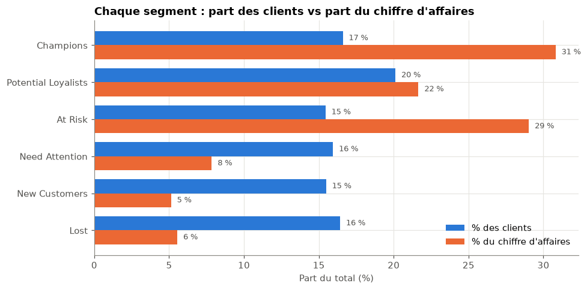
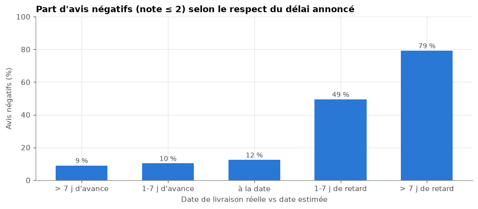
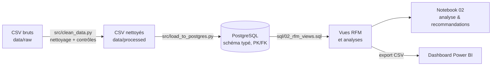
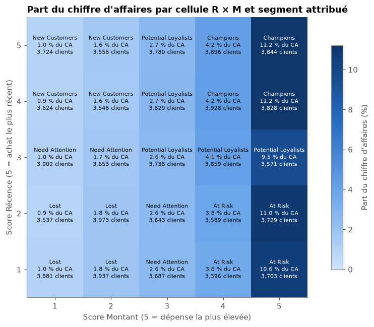

# Customer Intelligence : segmentation RFM d'un e-commerce (Olist)

Segmentation comportementale de **93 000 clients** d'une marketplace brésilienne (2016-2018) pour identifier où se trouve la valeur, quels clients sont en train de partir, et quels leviers activer pour les faire revenir.

**Stack :** Python (pandas, matplotlib, SciPy) · PostgreSQL (CTE, fonctions de fenêtrage, vues) · Power BI

---

## Résultats en bref

| | Constat | Implication |
|---|---|---|
| 🔁 | **97 % des clients n'achètent qu'une fois.** Même après plus d'un an, le taux de réachat plafonne à ~5 %. | L'enjeu n°1 est de déclencher la **deuxième commande**. |
| 💰 | **Champions + At Risk = 32 % des clients mais 60 % du CA** (~9,2 M R$). | Concentrer l'effort sur ces deux segments. |
| ⚠️ | **At Risk** : ~14 400 clients à fort panier (~310 R$), inactifs depuis ~1 an. | Priorité de réactivation. |
| 🚚 | Une livraison en retard fait passer les avis négatifs de **~10 % à 49-79 %**. | La satisfaction est un sujet **logistique**. |
| ⭐ | La note de la première commande **n'influence pas** le réachat (2,7 % à 3,1 %, p ≈ 0,07). | Le réachat est un sujet **marketing** : il faut inciter, pas seulement satisfaire. |

<p align="center">
  
  
</p>

## Problème métier

Une marketplace acquiert des clients qui, pour la plupart, ne reviennent jamais. Pour allouer un budget marketing limité, il faut savoir :
1. **quels clients génèrent la valeur** et lesquels sont en train d'être perdus ;
2. **pourquoi les clients ne reviennent pas** : insatisfaction ou manque d'incitation ?
3. **quelles actions prioriser**, et pour quels segments.

## Données

[Brazilian E-Commerce Public Dataset by Olist](https://www.kaggle.com/datasets/olistbr/brazilian-ecommerce) (Kaggle, licence CC BY-NC-SA 4.0) : ~100 000 commandes réelles et anonymisées, réparties dans 8 tables relationnelles (clients, commandes, articles, paiements, avis, produits, vendeurs, traduction des catégories).

Les données ne sont pas versionnées (~190 Mo) : voir [Reproduire le projet](#reproduire-le-projet).

## Pipeline



| Étape | Fichier | Contenu |
|---|---|---|
| 1. Exploration & qualité | [`notebooks/01_data_exploration.ipynb`](notebooks/01_data_exploration.ipynb) | Valeurs manquantes, doublons, clés, couverture temporelle, valeurs extrêmes, justification du nettoyage |
| 2. Nettoyage | [`src/clean_data.py`](src/clean_data.py) | Typage, traduction des catégories, contrôles d'intégrité (PK uniques, FK sans orphelins) |
| 3. Modélisation | [`sql/01_schema.sql`](sql/01_schema.sql) | Schéma relationnel typé avec clés primaires/étrangères et index |
| 4. Chargement | [`src/load_to_postgres.py`](src/load_to_postgres.py) | Chargement transactionnel, création des vues, export pour Power BI |
| 5. Scoring RFM | [`sql/02_rfm_views.sql`](sql/02_rfm_views.sql) | Scores R/F/M, segments, vues d'analyse (catégories, satisfaction, géographie) |
| 6. Requêtes métier | [`sql/03_analysis_queries.sql`](sql/03_analysis_queries.sql) | Poids des segments, réachat, lien satisfaction/réachat, top États |
| 7. Analyse | [`notebooks/02_rfm_analysis.ipynb`](notebooks/02_rfm_analysis.ipynb) | Validation, interprétation, tests statistiques, recommandations, limites |

## Méthodologie

**Périmètre :** commandes livrées uniquement. Le client est identifié par `customer_unique_id`, car Olist crée un nouveau `customer_id` à chaque commande.

| Dimension | Définition | Score |
|---|---|---|
| Récence | jours depuis le dernier achat (référence : dernière commande livrée, 29/08/2018) | quintiles |
| Fréquence | nombre de commandes livrées | seuils métier (1 / 2 / 3-4 / 5+) : quintiles impossibles avec 97 % d'acheteurs uniques |
| Montant | total payé (produits + livraison) | quintiles |

Les quintiles sont calculés avec `CUME_DIST` plutôt que `NTILE`, de sorte que deux clients à égalité reçoivent toujours le même score (segmentation déterministe). La fréquence étant peu discriminante, les **segments sont définis sur Récence × Montant**, et la fidélité est suivie à part (`is_repeat_customer`).

<p align="center">
  
</p>

## Recommandations

| Levier | Cible | Action | KPI |
|---|---|---|---|
| Déclencher la 2ᵉ commande | New Customers, Potential Loyalists | Offre ou relance automatisée 30-60 jours après le premier achat | Taux de réachat à 90 j |
| Réactiver | At Risk | Campagne personnalisée sur les catégories déjà achetées | Taux de réactivation |
| Protéger la valeur | Champions | Avantages (livraison offerte, accès prioritaire) | Rétention à 6 mois |
| Fiabiliser la livraison | Tous | Estimations de délai réalistes, suivi des vendeurs et régions en retard | % de commandes en retard |

Chaque action est à valider par un test A/B avant d'être généralisée.

## Limites

- **Censure à droite :** les clients récents ont eu moins de temps pour racheter. Le taux de réachat global (3 %) sous-estime le taux « mature » (~5 %).
- **Données partielles** fin 2016 et après août 2018 (extraction incomplète, pas une baisse d'activité).
- **Fréquence quasi constante :** le RFM se réduit en pratique à R × M. « Champion » signifie ici *récent et gros panier*, pas *client fidèle*.
- **Montant incluant la livraison :** il est gonflé pour les clients éloignés de São Paulo.
- **Seuils de segmentation choisis par règles métier**, non optimisés.
- **Corrélations, pas causalité :** les liens retard → insatisfaction et satisfaction → réachat sont observationnels.

## Dashboard Power BI

Trois pages alimentées par les vues SQL : vue d'ensemble, comportement produit et satisfaction par segment, géographie.

Le rapport est versionné sous forme de modèle [`dashboard/customer_intelligence.pbit`](dashboard/customer_intelligence.pbit) (pages, visuels, mesures DAX, sans les données). Pour l'utiliser, exécutez le pipeline, puis ouvrez le `.pbit` dans Power BI Desktop et connectez-le à la base PostgreSQL `customer_intelligence` ou aux CSV exportés dans `data/processed/`.

## Structure du repository

```
├── data/                     # non versionné : raw/ (Kaggle) et processed/ (généré)
├── dashboard/                # modèle Power BI (.pbit)
├── notebooks/
│   ├── 01_data_exploration.ipynb
│   └── 02_rfm_analysis.ipynb
├── reports/figures/          # graphiques exportés par les notebooks
├── sql/
│   ├── 01_schema.sql         # tables typées, PK/FK, index
│   ├── 02_rfm_views.sql      # scoring RFM et vues d'analyse
│   └── 03_analysis_queries.sql
├── src/
│   ├── config.py             # chemins et connexion (variables d'environnement)
│   ├── clean_data.py
│   └── load_to_postgres.py
├── .env.example
└── requirements.txt
```

## Reproduire le projet

**Prérequis :** Python ≥ 3.10, PostgreSQL ≥ 13.

```bash
# 1. Environnement
python -m venv .venv
source .venv/bin/activate          # Windows : .venv\Scripts\activate
pip install -r requirements.txt

# 2. Données : télécharger l'archive Kaggle et extraire les CSV dans data/raw/

# 3. Base de données
createdb customer_intelligence
cp .env.example .env               # puis renseigner PGPASSWORD

# 4. Pipeline
python src/clean_data.py           # data/raw -> data/processed (+ contrôles d'intégrité)
python src/load_to_postgres.py     # schéma, chargement, vues RFM, export CSV pour Power BI

# 5. Analyse
jupyter lab notebooks/
```

Le pipeline est idempotent : chaque exécution recrée le schéma et les vues à partir des données brutes.
